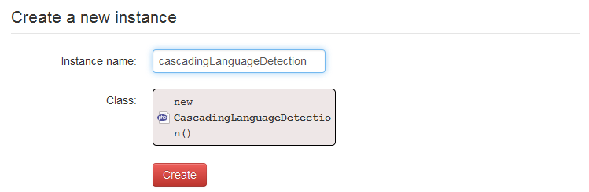
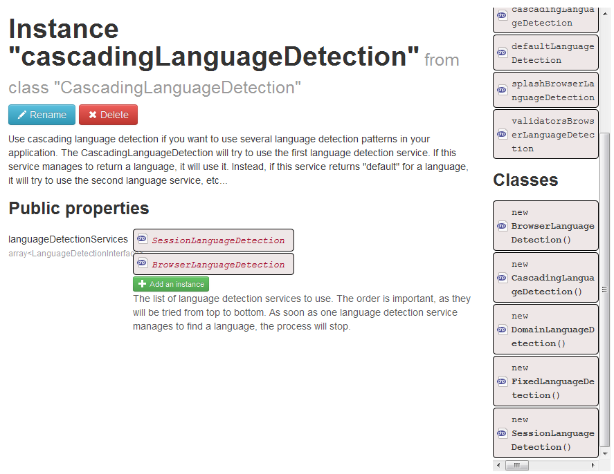
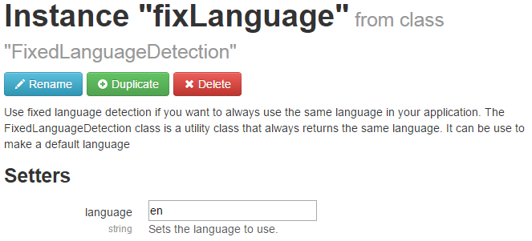

Installation
============

Installer
---------

The installer in Mouf framework create an instance of CascadingLanguageDetection and add it the FixedLanguageDetection with the language "en" for english.

Create instance
---------------

###With instance of Fine Common
- [Please see the translation inerface package](http://www.mouf-php.com/)[https://mouf-php.com/packages/mouf/utils.i18n.translation-interface]

##With only a translator

Create an instance of cascadingLanguageDetection "Instances" -> "Create a new instance"

Click on "add an instance" and drag and drop an instance of LanguageDetection in the array.
Caution to the order because the first language return is returned, so your new instance must be before the fixed instance. (in own case we added and DomainLanguageDetection)

Click on the new instance to configure it

Your language detection is ready ! 
